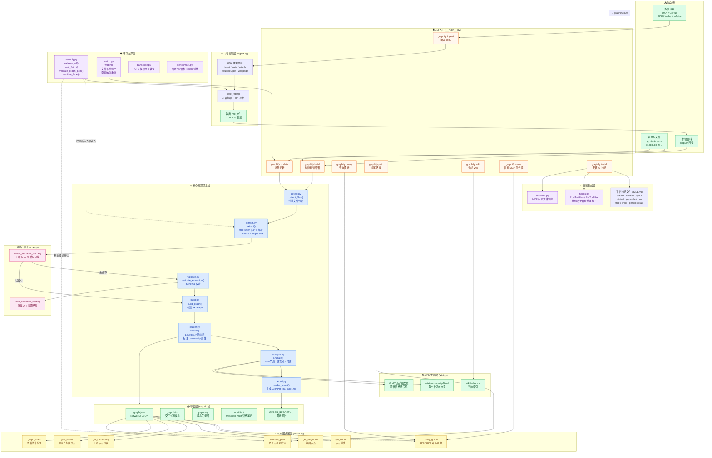

# graphify 功能框架图

## 核心概念说明

### 处理流水线

| 模块 | 函数 | 职责 |
|------|------|------|
| `detect.py` | `collect_files()` | 遍历目录，按扩展名过滤出可处理文件 |
| `extract.py` | `extract()` | 用 tree-sitter 解析源码，输出 `{nodes, edges}` dict |
| `validate.py` | `validate_extraction()` | 校验提取结果的 Schema 合规性 |
| `build.py` | `build_graph()` | 将提取结果列表合并为 NetworkX 图 |
| `cluster.py` | `cluster()` | Louvain 算法检测社区，为每个节点标注 `community` 属性 |
| `analyze.py` | `analyze()` | 识别 God 节点、惊喜连接、待审问题 |
| `report.py` | `render_report()` | 渲染 `GRAPH_REPORT.md` 供 AI Agent 快速定向 |

### 边的置信度标签

| 标签 | 含义 |
|------|------|
| `EXTRACTED` | 显式关系（import 语句、直接函数调用） |
| `INFERRED` | 推断关系（调用图二次分析、共现推导） |
| `AMBIGUOUS` | 不确定关系，标记供人工审核 |

### 支持的语言

Python · JavaScript · TypeScript · Java · C# · C · C++ · Go · Ruby · Rust · Swift · Lua · Markdown · PDF · 网页
